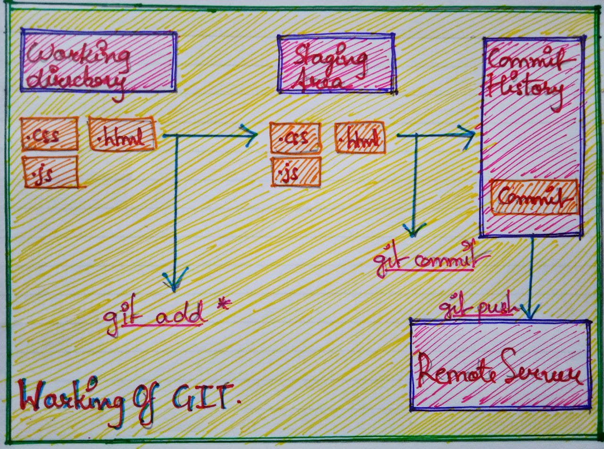

# Git

## Contents

- Git Introduction
- How Git works ?
- Git Basics and Workflow

---

### Git Introduction

- Git is a distributed version control system which is a tool that allows different users and developers to work on a project simultaneously
- Git provides the user the ability to:
  - Keep track of the changes made to a file
  - Keep record of all changes made to every file
  - Compare and analyze the difference between different codes
- Git helps users to work on a specific issue or bug, roll back to previous changes, and have multiple versions of the same code
- Git has two repositories involved in a project:
  - Local Repository : The repository made in the users system
  - Remote Repository : The repository made in the remote server

---

### How Git works ?

- When initialized in a folder in the system, git creates a `.git` folder
- User adds the file to the staging area, staging area is a place where modified file is kept before commiting
- Commits(a save point) are made to the modified file which are given special hash by which a commit can be identified
- The commits are then pushed to the remote repository that are created on the remote servers like Github, GitLab, Bitbucket. etc



---

### Git Basics and Workflow

- Configuring git in your system:

  - Inside the terminal(I used gitbash throughout) check if git is installed, if it is the version is displayed

  ```sh
  $ git --version
  ```

  - Set the username and email once git is installed

  ```sh
  $ git config --global user.name "helloyashrajput"

  $ git config --global user.email "yashdx9797@gmail.com"

  $ git config -l
  ```

- Basic commands :

  - `git init` : Creates a local .git repository
  - `git add *` : Adds all the files and folders inside current working directory to the staging area
  - `git commit -m"Message"` : Takes all the changes and saves them by giving unique hash id
  - `git status` : Gives the status of the latest commits and changes which are staged
  - `git push` : Pushes your files to the remote repository which is in the remote server
  - `git branch` : Lists all the branches inside the repository
  - `git merge` : Join two branches and create a commit for updated changes
  - `git fetch` : Fetches the latest changes from remote repository to the local repository
  - `git pull` : Fetches and merges the latest changes from the remote repository
  - `git clone` : Clones the copy of the remote repository to the local repository
  - `git checkout` : Helps in switching and creating branches
  - `git log` : Lists history of commits made in the repository

- ```sh
  //Initializing Git Repository

  $ mkdir learning-git   ->Creates local repo
  $ cd learning git      ->Switches to the repo
  $ git init             ->Initializes .git folder
  $ touch index.html     ->Creates a file
  $ touch script.js      ->Creates second file
  $ git status           ->Status of the changes made

  //Git Add

  $ git add *            ->Adds file to the staging area
  $ git commit -m"index.html was created"
                        ->Commits the changes at the savepoint
  $ git status          ->Status of the changes made
  $ git rm --chached index.html
                        ->Unstages file from staging area
  $ git add *           ->Adds file to the staging area

  //Git Commit

  $ git log             ->List history of commits made
  $ cat script.js       ->Writes the file
  console.log("New Content Added");
  $ git diff            ->Shows the changes made
  $ git commit --amend -m"Added cosole.log"
  $ git push -u origin main
                        -> pushes repository to remote
                           server to specified branch

  //Working with Branches

  $ git branch          ->Returns current branch
  $ git branch -r       ->Remote branch list
  $ git branch -a       ->List all branches
  $ git branch feature-1
                        ->Creates a branch
  $ git checkout feature-1
                        ->Switches branch
  $ git checkout -a     ->Switches to previous branch
  $ git checkout -b feature-2
                        ->Creates and swithces to new branch
  $ git branch -d feature-2
                        ->Deletes branch
  ```
