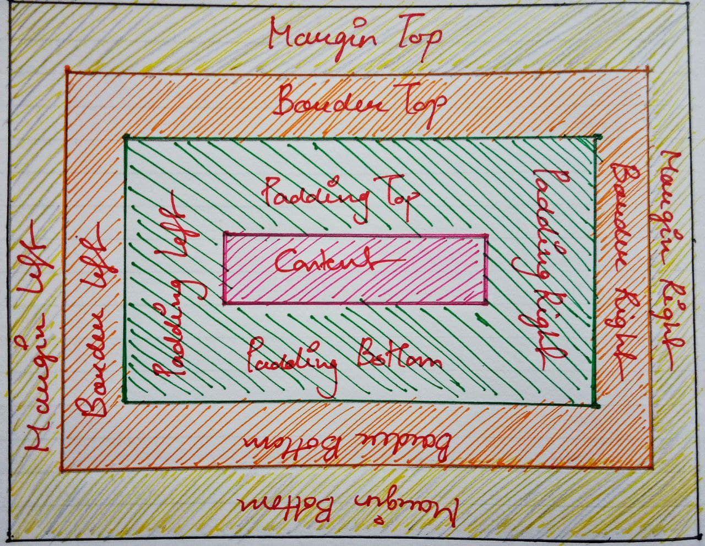
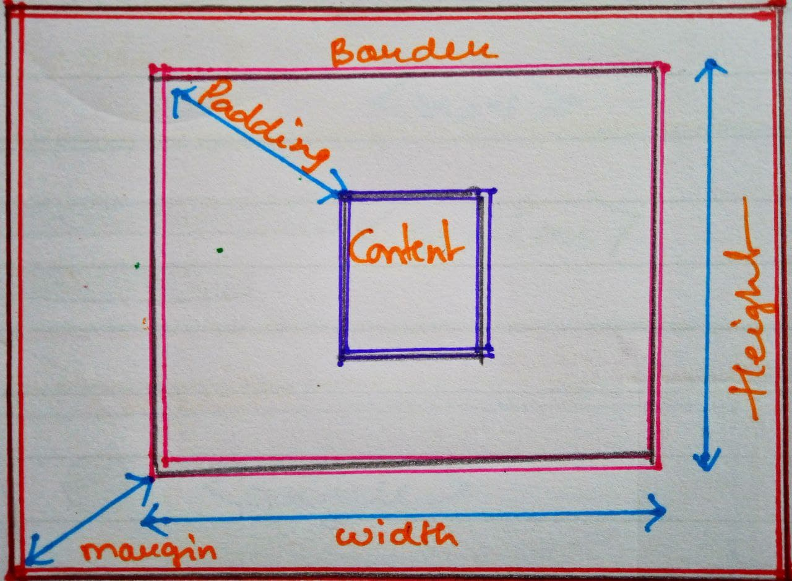
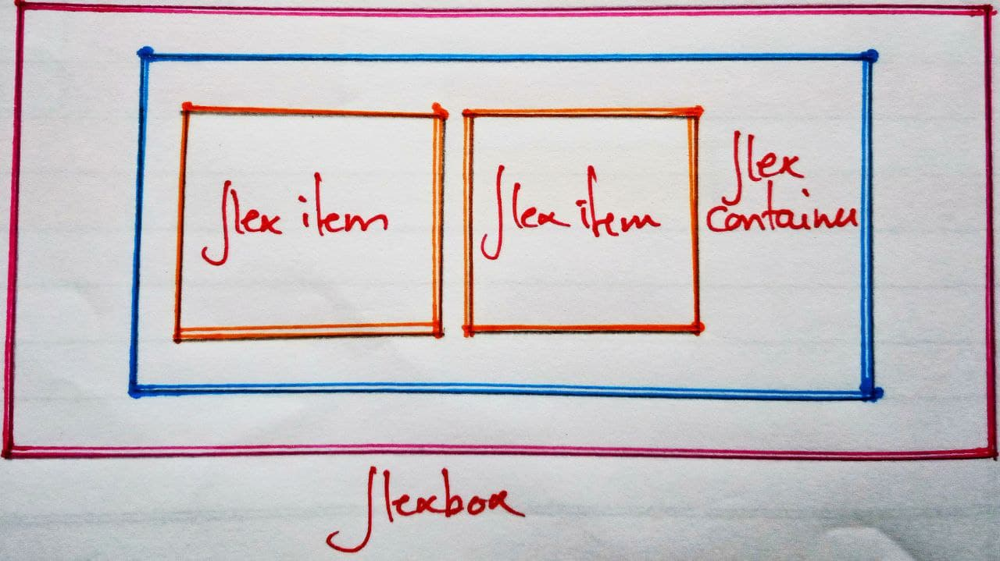
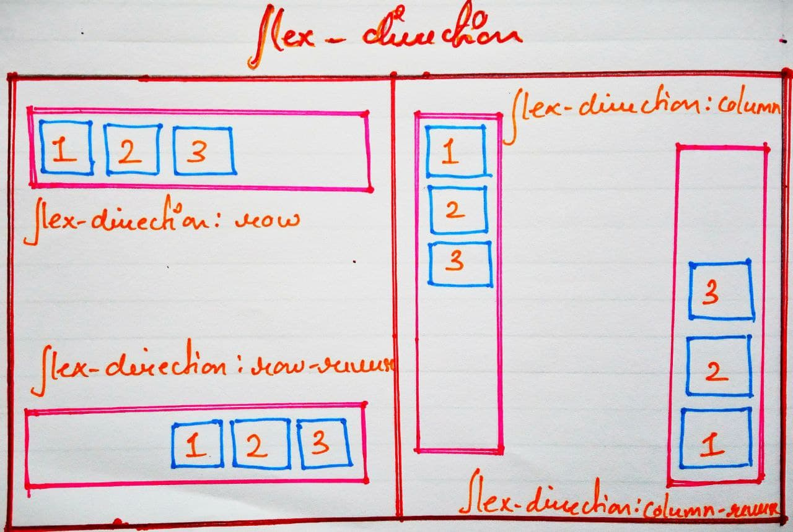

# CSS

## Contents

- CSS Selectors
  - Simple selectors
  - Combinator selectors
  - Pseudo selectors
- Fonts and Colors
- Background and Borders
- Box model
- Inline, block, inline-block display
- Flexbox basics and properties
- Positioning
- Media Queries
- SASS

  - Node-Sass

  - Variables and partials

  - Functions and mixins

  ***

### CSS Selectors

CSS Selectors are used to link html elements to the CSS files.

- Simple selectors:

  - Element Selectors : Element selectors selects html elements names

  ```css
  h1 {
    font-size: 18px;
    color: purple;
  }
  ```

  - ID selectors : Uses id attribute with '#' in the start within the html elements to select the element and is unique for every element

  ```css
  #div {
    background-color: deepskyblue;
  }
  ```

  - Class selectors : Element those have the class attributes are select using '.' followed by class name

  ```css
  .button-name {
    background-color: blue;
    border: none;
    color: white;
  }
  ```

  - Universal selectors: Selects evry html elements in the html file using ' \* '

  ```css
  * {
    font-size: 24px;
    margin: 0;
    padding: 0;
  }
  ```

- Combination selectors:
  - Multiple elements are selected together with ' , ' seperating them
  ```css
  h1,
  h2,
  div {
    text-align: left;
    color: white;
  }
  ```
- Pseudo-selectors:

  - There are two types of pseudo selectors:

    1. Pseudo element selector : Used to select parts of the element and is followed by ' :: '

    ```css
    p::first-letter {
      color: red;
      font-size: 200%;
    }
    ```

    1. Psuedo class selector : Used to select elements based on the state of the class

    ```css
    button:hover {
      background: red;
    }
    ```

---

### Fonts and Colors

- There are different keywords using which fonts can be styled or changed
  - font-family
  - font-size
  - font-style
- Can also link fonts from external sites such as google fonts

```css
@import url("https://fonts.googleapis.com/css2?family=Roboto&display=swap"); /*Includes roboto font from google font*/
div {
  font-family: "Roboto", san-serif;
  font-style: normal;
  font-size: 2.5rem; //1rem = 16px;
}
```

- Color can be defined using two ways:
  - Using keyword(name of the color) or hexadecimal value of the color;
  - Using RGB value of the color(rgb() and rgba())
- Colors can be applied to any element in the html file

```css
h1 {
  color: blue;
}
h2 {
  color: ffa500;
}
h3 {
  color: rgb(252, 3, 3);
}
h4 {
  color: rgba(248, 252, 3, 0.3);
}
```

---

### Background and Borders

- Background property is used to style background properties all at once
- They have properties such as :
  - background-repeat : Css repeats the background image horizontally and vertically this property makes the background more attractive
  - background-color : Specifies background color of an element
  - background-image : Sets an image to the background of an element
  - background-positon : Specifies the position of the image

```css
body {
  background-color: deepskyblue;
  background-image: url("background.jpg");
  background-repeat: no-repeat;
  background-position: center;
}
```

- Border properties allows to style the border of the elements
- Following are some border properties:
  - border-style : Specifies the border style of an element, has value from left -> top -> right -> left
  - border-width : Specifies width on all sides
  - border-color : Specifies the color of border
  - border-radius : Helps to achieve rounded borders

```css
div {
  border-style: solid;
  border-width: 5px;
  border-color: red;
  border-radius: 5px;
}
/*or*/
div {
  border: 5px solid red;
  border-radius: 5px;
}
```

---

### Box model

- Every element in structure of a website is in rectangle box form
- The structure of the box model consists of:
  - Content
  - Padding
  - Border
  - Margin




---

### Inline, block, inline-block display

- CSS display property determines how the box of the element will be shown on the screen or whether or not to hide them
- These are some display properties:
  - display: none
  - display: block
  - display: inline
  - display: inline-block

```css
/*The box will not be shown on the screen*/
#box-1 {
  display: none;
}
/*Helps to align block level item side by side*/
p {
  display: inline;
}
/*Allows to se height and width as well*/
p {
  display: inline-block;
  height: 100px;
  width: 100px;
  background: red;
  color: white;
}
```

---

### Flexbox basics and properties

- Flexbox is used to create responsive layouts and components of a webpage
- Property of `display: flex` given to element for using flexbox
- Flex-direction:
  ```css
  flex-direction: row; /*place flex-items in row (horizontal).*/
  flex-direction: row-reverse; /*place flex-items in row but in reverse order.*/
  flex-direction: column; /*place flex-items in column (vertical).*/
  flex-direction: column-reverse; /* place flex-items in column but in reverse order.*/
  ```
- Flex-wrap:

  ```css
  flex-wrap : nowrap /*will not wrap flex-item in flex-container.*/
  flex-wrap : wrap /*will wrap flex-item in flex-container if it not fit in container*/
  ```

- Justify-content:

  ```css
  justify-content: flex-start /*will place flex-item to the start of flex-container*/*
  justify-content: flex-end /*will place flex-item to the end of flex-container*/
  justify-content: center /* will place to center flex-items.*/
  justify-content: space-around /*space up around item.*/
  justify-content: space-between /*it uses the whole frame and space item between.*/
  justify-content: space-evenly /*space all item evenly*/
  ```

  
  

---

### - Positioning

- Positioning properties helps to determine position of an element in a document
- There are five values a property can take:

  - static
  - relative
  - absolute
  - fixed
  - sticky

```css
/*Remains same as normal document*/
.position-element {
  position: static;
  left: 10px;
  bottom: 10px;
  background-color: yellow;
}
/* left and bottom properties now affect the position of the element*/
.position-element {
  position: static;
  left: 10px;
  bottom: 10px;
  background-color: yellow;
}
/*The element gets position relative to other elements*/
.position-element {
  position: absolute;
  left: 10px;
  bottom: 10px;
  background-color: yellow;
}
/*element stays fixed to the screen*/
.position-element {
  position: fixed;
  bottom: 10px;
  left: 10px;
  background-color: yellow;
}
/*stays fixed until the breakpoint comes*/
.position-element {
  position: sticky;
  top: 10px;
  background-color: yellow;
}
```

---

### Media Queries

- Media Queries are used to make the site mobile responsive
- They work like if statement and are excuted if the condition are met

```css
.heading {
  background-color: red;
  font-size: 24px;
}
/*will only be excuted if the screen width is 720px or below*/
@media all and(max-width:720px) {
  .heading {
    background-color: orange;
    font-size: 34px;
  }
}
```

---

### SASS

- SASS is a CSS preprocessor which allows us to create variables, functions, mixins inside a css file.
- It uses `.scss` extension and is written same as css, it helps us to manage large css files and split it in different scss files

  - Node-Sass :

    - SASS requires node and npm installed in the system inorder to run
    - It helps to watch a sass file to a css file

    _Watches the sass files realtime and auto compiles to the css file_

    ```sh
    $ node-sass --watch sass --output folder-name/
    ```

  - Variables and partials :

    - SASS allows us to create variables for colors or font-sizes and use it in any other file.

    ```css
    /*Declares a variables called $background-color*/
    $background-color: #ff0000;
    ```

    - Partials allow us to create seperate `.scss` files and import in different file and has a file name that starts with an underscore

    ```css
    /*imports file _variables.scss*/
    @import "variables";
    ```

  - Extend and Mixins :

    - Extend helps us to use already defined css and use it within another element

          ```css
          .menu-button {
          padding: 10px;
          border: 1px solid black;
          background: #777;
          color: #fff;
          }
          .home{
          @extend .menu-button; /**Adds .menu-button styles to .home*/
          font-weight: bold;
          ```

    - Mixins are similar to extend but they also allow to use parameters

      ```css
      @mixin alert {
        color: red;
        fnt-size: 25px;
        font-weight: bold;
        border: 1px solid blue;
      }
      .danger-alert {
        @include alert;
        background-color: green;
      }
      ```

---
