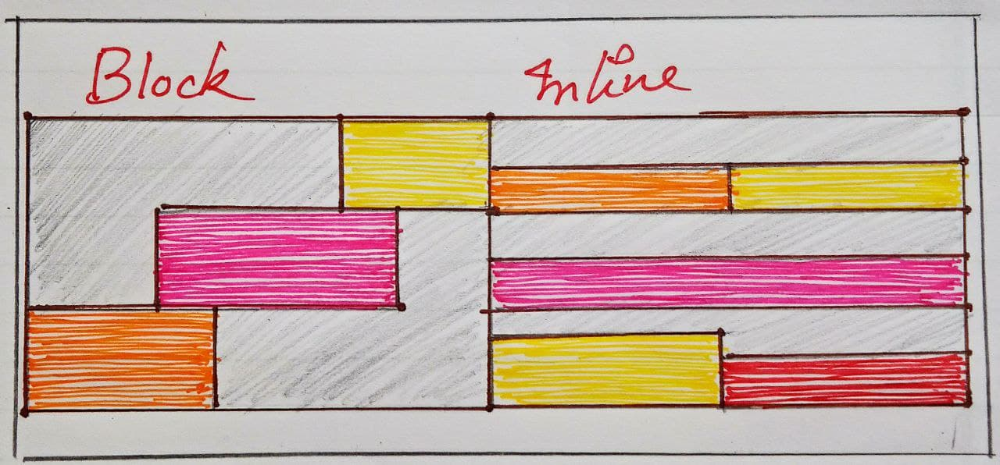
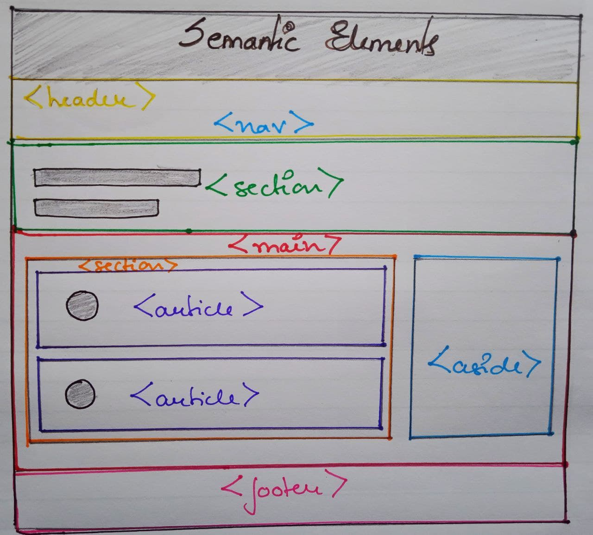

# HTML

## Contents

- [HTML Structure](https://github.com/helloyashrajput/missingskill-learning/blob/master/html-css/html.md#html-structure)
- [Meta Tags](https://github.com/helloyashrajput/missingskill-learning/blob/master/html-css/html.md#meta-tags)
- [Headings and Paragraph](https://github.com/helloyashrajput/missingskill-learning/blob/master/html-css/html.md#headings-and-paragraph)
- [Link and Images](https://github.com/helloyashrajput/missingskill-learning/blob/master/html-css/html.md#link-and-images)
- [List and Tables](https://github.com/helloyashrajput/missingskill-learning/blob/master/html-css/html.md#list-and-tables)
- [Form and Inputs](https://github.com/helloyashrajput/missingskill-learning/blob/master/html-css/html.md#forms-and-input)
- [Block and Inline Elements](https://github.com/helloyashrajput/missingskill-learning/blob/master/html-css/html.md#block-and-inline-elements)
- [Class and IDs](https://github.com/helloyashrajput/missingskill-learning/blob/master/html-css/html.md#class-and-ids)
- [HTML5 semantics](https://github.com/helloyashrajput/missingskill-learning/blob/master/html-css/html.md#html5-semantics)

---

### HTML Structure:

- HTML (Hyper Text Markup Language) is the most widely used markup language which is used to define structure of a page.
- HTML is a tool to create a structure of the page
- Basic Structure of a Page:

```html
<!DOCTYPE html> (Tells the bowser that its HTML document)
<html lang="en">
  (Main HTML Opening Tag)
  <head>
    (Header tag)
    <meta charset="UTF-8" />
    <meta http-equiv="X-UA-Compatible" content="IE=edge" />
    <meta name="viewport" content="width=device-width, initial-scale=1.0" />
    <link rel="stylesheet" href="css/style.css" />
    (Links the css file)
    <title>Missingskills Grind</title></head
  >(Header Closing Tag)
  <body>
    (Main Body)
  </body>
</html>
(HTML closing tag)
```

---

### Meta Tags

- Meta tags have metadata that are used by search engines for search engine optimizations (SEO)
- They are placed inside the Header Tag
- Some of the meta tages are :

```html
<head>
  <meta
    name="description"
    content="This is the description of the website that would be seen in the browser search"
  />
  <meta name="author" content="your-name" />
</head>
```

---

### Headings and Paragraph

- Heading tags gives importance to each headings in 6 levels
- They range from heading 1 to heading 6
- They go from big to small in sizes in ascending order

```html
<h1>Heading 1</h1>
<h2>Heading 2</h2>
<h3>Heading 3</h3>
<h4>Heading 4</h4>
<h5>Heading 5</h5>
<h6>Heading 6</h6>
```

- The paragraph text is used to display a paragraph with in the body section of the html
- These are block elements and covers the whole block of space across the screen

```html
<p>
  Lorem ipsum dolor sit amet, consectetur adipiscing elit. Etiam non lacus
  velit. Mauris dignissim feugiat justo, id vehicula purus facilisis vel. Ut
  vitae laoreet quam.
</p>
```

---

### Link and Images

- Anchor tags are used to create hyperlinks in an HTML page.
- Uses 'href' attribute to provide the destination link, folder or location

```html
<a href="https://www.google.co.in">Google</a>
<a href="https://twitter.com/helloyashrajput">Twitter</a>
<a href="https://github.com/helloyashrajput?tab=repositories">Github</a>
```

- Images are displayed on the html page using img tag
- It has source and alternative text attribute to provide source of the image and the alternative tex to be displayed when the image does not load

```html

```

---

### List and Tables

- There are three types of lists ordered list, unordered list and definition list.

```html
<body>
  <ol>
    <li>List item 1</li>
    <li>List item 2</li>
  </ol>
  <ul>
    <li>List item 1</li>
    <li>List item 2</li>
  </ul>
  <dl>
    <dl>List item 1</dl>
    <dl>List item 2</dl>
  </dl>
</body>
```

- Tables are used to show data in rows and columns format

```html
<table>
  <thead>
    <tr>
      <th>Content</th>
      <th>Description</th>
    </tr>
  </thead>
  <tbody>
    <tr>
      <td>Data 1</td>
      <td>Data 2</td>
    </tr>
  </tbody>
</table>
```

---

### Forms and input

- Form tags are used to created interactive inputs for the user to submit in the html page
- Different elements are used with in a form to allow user to submit information.

```html
<form>
  <label>Name:<input name="user-name" /></label>
  <input type="square" name="radio">Checkbox</label>
  <button>Save</button>
</form>
```

- Input elements are used to create interactive form controls
- They are placed inside form tag

```html
/*These are some of the most used input elements*/
//button
<input type="button" value="Button" />
-------
//checkbox
<input type="checkbox" id="scales" name="scales"
         checked>
  <label for="scales">Scales</label>
</div>
-------
//email
<input type="email" id="email" name="email">
-------
//password
<input type="password" id="pass" name="password" minlength="8" required>
-------
//date
<input type="date">
-------
//file
<input type="file" id="Image" name="Image" accept="image/png, image/jpeg">
-------
//submit
<input type="submit" value="Submit">
-------
//text
<input type="text" id="user-name" name="user-name" required maxlength="15">
```

---

### Block and Inline Elements

- Block element takes up full width of the screen avaiable and starts the new element on the next line
- Inline elements take only specified space and starts new element right next to the previous element
- Div is a block level element and span is an inline element
- Div is used to wrap sections and divide the page in blocks.
- Span is used to create inline containers and can be used to group elements for styling purposes

```html
<div>This is a block element</div>
<span>This is an inline element</span>
```



---

### Class and IDs

- Class and id are attributes that allows the user to connect the javascript and css files to the html files using class selectors and fucntions
- Each element is given unique id which can be used to identify the element

```html
<h1 id="heading-1">Heading with an ID</h1>
<h1 class="heading-1">Heading with a class</h1>
```

---

### HTML5 semantics

- HTML semantic tags allows the search engines to understand the page structure in a more proper manner.
- Semantic tags instructs the browser to prioritise the page content
- Following are some semantic tags:

```
<article>
<aside>
<details>
<figcaption>
<figure>
<footer>
<header>
<main>
<mark>
<nav>
<section>
<summary>
<time>
```

## 

---
