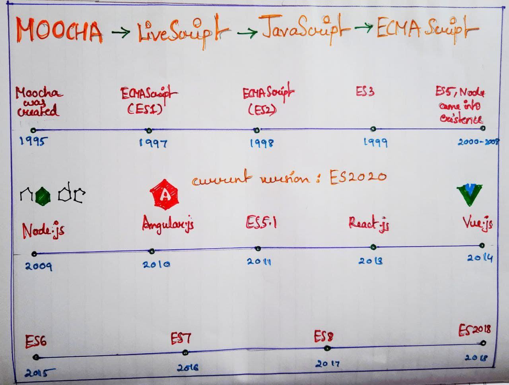
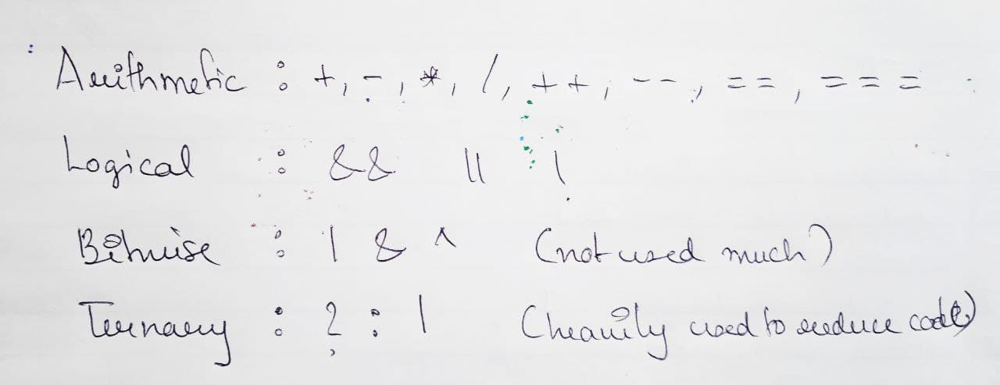
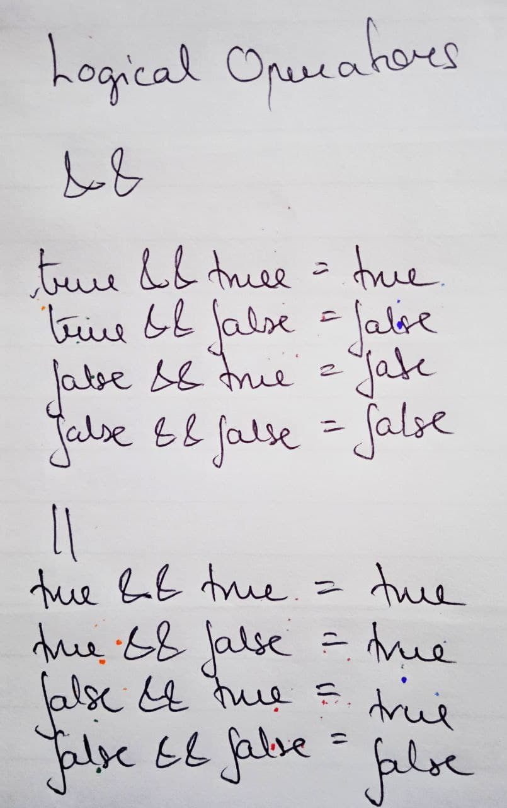

# JavaScript

---

## Content

- History
- Control Structure
- Operator
- Tech Debt
- Variable
- Object and Array
- Function
- Built-in ES6 functions

---



---

### Control Strucutre

- if-else

```js
let age = 23;
if (age > 18) {
  console.log("You can apply for license");
} else {
  console.log("You have to wait " + 18 - age + " years to apply.");
}
```

- for
- switch case
- while
- do-while

---

### Operators




```js
// Arithmetic Operator(+,-,*,/,++,--)
const now = 2021;
const ageYash = now - 1997;
const agePallavi = now - 1998;
console.log(ageYash, agePallavi);

const firstName = "Yash";
const lastName = "Rajput";
console.log(firstName + " " + lastName);

// Assignment operators
let x = 10 + 5; // 15
x += 10; // x = x + 10 = 25
x *= 4; // x = x * 4 = 100
x++; // x = x + 1
x--; // x = x - 1

// Comparison operators  (>, <, >=, <=)
console.log(ageYash > agePallavi);
console.log(agePallavi >= 18);

//Logical operators
const hasBike = true;
const hasLicense = true;

console.log(hasBike || hasLicense); //true
console.log(hasBike && hasLicense); //true
console.log(!hasBike); //false
```

---

### Tech Debt

Cannot change it in future updates as it would end up crashing browser

- +(Concatenation and addition) a + a = aa
- == (Normal check) ===(Equality check)
- typeof null (Object)

---

### Variables

- Variables are containers that hold values
- There are two types of variables:
  - Static (Needs to be compiled)
  - Dynamic (Does not needs to be compiled)
- Javascript is dynamic type
- There are two datatypes in Javascript:
  - Primitive (Once defined cannot be changed)
    - String
    - Numbers
    - Boolean
    - Null
    - Undefined
  - Non Primitive (Can be updated after Declaration)
    - Array
    - Object
- Everthing in javascript is an object even array has type of object

  | var                           | let                             | const                           |
  | ----------------------------- | ------------------------------- | ------------------------------- |
  | ES5                           | ES6                             | ES6                             |
  | Value can be reassinged       | Value can be reassinged         | Value cannot be reassignded     |
  | Functional scope              | Lexical scope                   | Lexical scope                   |
  | Hoisted to top of thier scope | Hoisted to the top of the block | Hoisted to the top of the block |

```js
var my_job = "Web Developer";
/*Can be used within the whole program*/
let my_experience = "2 Years";
/*Can be used within the scope of declaration*/
const my_name = "Yash Rajput";
/*Can never change the value*/
my_name + " " + my_job; //Outputs Web Developer Yash Rajput
```

- JavaScript variables can be converted to a new variable and another data type

```js
String(96); //returns string "96"
(69).toString(); //Returns string aswell"69"
var a = {}; //undefined
console.log(!!a); //true
var num = Number("100"); //Typecasting to number
var num = 1 + "100"; //concatenates

100 + +"18"; //Adds to 118
100 + +"18"; //Concatenates to 10018
```

- When using arithmetic operators boolean is always converted to 0 and 1

```js
let name = null; //typeof name object
let age = 23;
name + age = 23 // Null value to 0
```

- Adding anything to undefined will return NaN(Not a number), can be converted to a string

```js
undefined + "2"; // undefined2
```

- String has precedence overall when using "+"

```js
null + null; //returns 0
null / null; //returns NaN
```

- Anything not zero in boolean is true

```js
y = 17; //true ->  Truthy
y = 0; //false ->  Falsy
y = NaN; //false -> Falsy
string = " "; //false -> Empty string
null = undefined; //false
```

- Anything other than above values are true
- To convert any try value to false value add " ! " and vice versa

```js
var value = 8; //true
!value; //false
```

- Falsy values - "", null, undefined, 0, false, NaN
- Truthy Values - objects and non primitive are always truthy

### Object and Array

- An array is a collection of items. Arrays store data as elements and retrieve them back when you need them.
- Array is an index based object
- First element has an index of 0 and last element has an index of number of elements-1

```js
const arr = [1, 2, "arr_element"]; //Array Declaration
arr[0]; // Returns 1
arr.push(3); //Add new element to the end of array
arr.unshift(0); // Adds to the start of the array
arr.pop(); //Removes elements from the end of the array
arr.shift(); //Removes first element
arr.indexOf(2); //Returns 1

const first = [1, 2, 3];
const second = [4, 5, 6];
const merged = first.concat(second);
console.log(merged); // [1, 2, 3, 4, 5, 6]

const result = merged.filter((merge) => merge > 4);
console.log(result);

const map1 = first.map((x) => x * 2);
console.log(map1);
```

- Array methods:

  - push() : Insert an element at the end of the array
  - unshift() : Insert an element at the beginning of the array
  - pop() : Remove an element from the end of the array
  - shift() : Remove an element from the beginning of the array
  - slice() : Create a shallow copy of an array
  - Array.isArray() : Determine if a value is an array
  - length : Determine the size of an array
    concat
  - map(): Used to transform any items
  - filter(): Used to filter array values
  - indexOf() : Returns the index position of an element
  - concat() : Merges one or more arrays and returns a merged array

- Object are variables that can store any type of value and even other complex variables
- Objects are similar to array but instead of indexes they use `name:value` pairs called properties
- `name(property): value(Property Value)`
- Object properties can be accesed using dot notation or bracket notation

```js
//Object declaration using object literal
var my_details = {
  my_name: "Yash",
  my_age: 23,
};
// Dot Notation for accessing object
var name = my_details.my_name;
// Bracket Notation for accessing object
var age = my_details["my_age"];
// Updating object property
my_details.my_name = "TrippyB";
// Adding new property to an object using dot notation and bracket notation
my_details.my_job = "Web Developer";
my_details["my_city"] = "Mumbai";
//Deleting property
delete my_details.my_name;
```

- Variable declaration using var keywork function gets hoisted to the top, not the assignment

```js
var a; //value if undefined
```

- Const variable must be declared and initialized

```js
const a = 10; //let and const doesnt get hoisted
```

---

### Function

- Functions are one of the fundamental building blocks in JavaScript
- It is a block of code that can be used multiple times when invoked
- Function can have multiple parameters or no parameters
- In ES5 functions behaves like objects
- Function gets hoisted, even if function gets declared after calling, the function will execute
- Can be Overridden
- They have truthy values and have type of `function`
- Function can return function and objects both
- An anonymous function is a function that has no name.

```js
var fullName = function (firstName, lastName) {
  return `${firstName} ${lastName}`;
};
fullName("Yash", "Rajput"); //Yash Rajput
```

- Pure function : When we pass a value to the function and returns same value

```js
//Pure function
function sum(a, b) {
  return a + b;
}
sum(5, 6);
```

```js
function add(a, b) {
  return a + b;
}
add(5, 6);
```

- A scope defines the lifetime visibility of a variable. Variables are not visible outside the scope in which they are declared
- Types of scope:

  - Function scope : Variables and Parameters declared inside a function are accessible inside the function but not outside the function
  - Block scope : Block scope is defined between curly braces
  - Lexical scope : In a nested function the child function have access to variables of the parent function
  - Global scope : Variables in the global scope can be accessed from everywhere

  ```js
  var x = 33;
  function func() {
    // Function Scope
    consolelog(x);
    function inner() {
      //Lexical Scope
      console.log(x);
    }
    inner();
  }
  func();
  {
    // Block Scope
    console.log(x);
  }
  ```

- ### IIFE

- IIFE (Immediately invoked function expression): A function invoked immediately even without the instantiation
- It can only run once and cannot be called
- CLosure refers to accessing private variables
- In ES6 function can be written without using function keywork

```js
//anonymous funcion
(function () {
  console.log("Hello Yash her");
})(); //Invoked immediately
```

- Arrow Function
  - Arrow functions allow us to write shorter function syntax
  - Introduced in ES6 , it doesn't hoisted

```js
var a = () => {
  console.log("Hello Arrow");
};
b();
```

- Inline function

  - Inline function is assigned to a variable created at runtime

  ```js
  const array = [1, 2, 3];

  array.map((number) => number * 2);
  ```

- String Methods

  - ToUpperCase : convert the string into upper case

  - ToLowerCase : convert the string into lower case

  - Split : slipt the string and return array

  ```js
  my_name = "Yash Rajput";
  my_name.toUpperCase();
  my_name.toLowerCase();
  my_name.split("");
  ```

### Build in ES6 functions

- SetTimeOut: setTimeout method will wait for an amount of time, and then perform a task

```js
setTimeout(() => {
  alert("Message after 5 seconds");
}, 5000);
```

- SetInterval : setInterval method calls a function at specified interval of time(in milliseconds)

```js
setInterval(() => {
  console.log(Math.random());
}, 1000);
```

- ParseInt : The parseInt() function parses a string and returns an integer.

```js
let a = parseInt("10");
```

- ParseFloat: The parseFloat() function parses a string and returns a floating point number

```js
var a = parseFloat("10");
```
