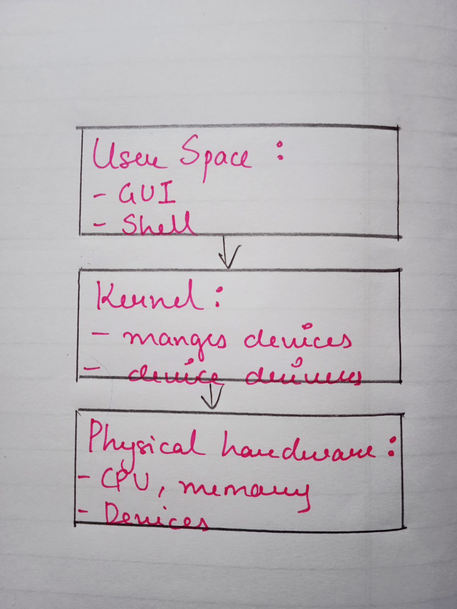

# Linux

## Contents

- Background and history of Unix and Linux

- Structure of Linux
- Shells

  - Different types of shells

- Commands in Linux
- Linux File system
- Summary

---

### Background and history of Unix and Linux

#### 1970's:

- Bell labs created Unix which they sold commerically.
- Companines and universities started using Unix.
- Berkley Created Berkeley Software Distribution(BSD).

#### 1980's:

- Richard Stallman created Free Software Foundation(FSF).
- GNU was created with kernal called HURD which was limited.
- BSD created BSD/UNIX.

#### 1990s:

- Linus Torvalds created his own kerlnel called Linux written in C and made it free.
- Richard Stallman and Linux Torvalds together created GNU/Linux.
- Google was created based on GNU/Linux.

#### 2000s:

- 99% of worlds technology runs on linux.
- Around 2000 distributions.

---

### Structure of Linux

1. A Linux distribution is composed of kernel and additional libraries and software that are added.

1. There are many distributions of Linux

1. Popular Distributions:
   1. GNU Linux (First Distribution)
   1. Debian (Most Popular):
      1. Ubuntu (Has 80% of market share)
   1. Red Hat Enterprise Linux:
      1. Fedora
      1. Mint
      1. CentOS
1. Can be either commercial or non commercial.



- Application -> Kernel -> CPU + Memory + Devices.

---

### Shell

- Kernel allocates the system resources and coordinates the system internals.
- Shell is a CLI through which the user interacts with the kernel.
- Shell script is a list of commands which are listed in order of execution.

#### Different types of Shell:

- Bourne Shell:

  - Created by Stephen Bourne and is even used today.
  - In some cases used as default root shell.
  - Has grammer similar to Algorithmic Language(ALGOL).
  - Had 2 primary goals: 1. Command Interpreter 2. Scripting.

- C Shell:

  - Created by Bill Joy for BSD/Unix.
  - Objective was to achieve scripting language which was similar to C programming language.

- Korn Shell:

  - Created by David Korn.
  - Combines features of both Bourne and C Shell.
  - Backward compatible with Bourne Shell
  - Had C shell features like command history and command aliasing.

- TENEX C Shell:

  - Started out as a derivitive of C Shell
  - Had a programmable command line completion and editing features added to it.

- Bourne-Again Shell(BASH):
  - Most widely used shell
  - Shows all features of Bourne shell but is easy to use and more efficient.
  - Supports control structures for conditional testing and iteration.

---

### Commands in Linux

- Following are some of the Commands used to navigate through Linux:
- pwd (Print working directory):

```sh
$pwd
/*Prints current working directory*/
eg: /d/studies/missingskills-learning/linux
```

- cd (Change directory):

```sh
$cd d:/studies/
/*Changes directory to the specified directory*/
$cd -
/*Switches to previous directory*/
$cd ..
/*Goes one step/directory back*/
$cd ~
/*Goes to home directory*/
```

- ls (List files):

```sh
$ls
/*Displays the files within current directory */
eg:
script.js
index.html
style.css
app.js

$ls -l
/*Displays descriptive list*/
$ls -a
/*List all hidden files*/
```

- mkdir (Make directory):

```sh
$mkdir new-folder
/*Create a new directory*/
$mkdri directory1 directory2 directory3
/*Creates multiple directories*/
$mkdir directory1/directory2
/*Creates a sub-directory with a directory*/
```

- touch:

```sh
$touch new_file
/*Creates a new file*/
```

- echo:

```sh
$echo Hello
/*Used to print a line*/
```

- man:

```sh
$man ls
/*Provides manual of the command specified*/
```

- rm (Remove):

```sh
$rmdir directory_name
/*Removes specified  empty directory*/
$rm -rf directory-name
/*Removes files with directory*/
```

- cat:

```sh
$cat file-name
/*Reads content of the file*/
$cat > file-name
/*Writes content to the file*/
$cat >> file-name
/*Overwrites the file*/
```

- cp (Copy):

```sh
$cp source-file destination-directory
/*Copies file to the specifed directory*/
$cp ../directory_name
/*Copies files from previos directory to the current directory*/
```

- mv (Move):

```sh
$mv file-name directory-name
/*Moves file to the specified directory*/
$mv file-name new-file
/*Renames the file*/
```

- top:

```sh
$top
/*Gives system level information and current load of the system*/
```

- ssh:

```sh
$ssh username@root(Ip/hostname)
/*Enables two networks to communicate securely*/
```

- which:

```sh
$which file-name
/*Gives location of the file, software or commands*/
```

- history:

```sh
$history
/*Gives list of commands which were previously executed*/
```

- who:

```sh
$who
/*Gives list of currently logged users into the system*/
```

- whoami:

```sh
$whoami
/*Displays current system user*/
```

- exit:

```sh
$exit
/*Exits the current shell*/
```

- ifconfig:

```sh
$ifconfig -a
/* Displays all interfaces available and shows my ip and network connectivity*/
```

```sh
$tail -number_of_lines file-name
/*Watches the files and writes to it*/

$cat > file-name
/*Keeps adding content and displays at the shell where tail Command is executed*/
```

---

### Linux File system

> -/boot : It contains the kernel

> -/bin : User level binary files are stored in bin directory

> -/$bin : System level binary files are stored which are accessed by system admins

> -/home : New users are created in home directory

> -/var : Variable files are stored in this directory

> -/usr : It contains user system resources

> -/root : Root users are created inside this directory

> -/temp : In this directory temporary files are stored

> -/etc : System configuration can be found here

> -/lib : It has system libraries

> -/mnt : Can be used to mount CDROMS. Obselete path now

> -/dev : Contains memory files which store devices connected to the system

> -/opt : Used to install software packages

---

### Summary

As a windows user right from the start, I found Linux to be quite different experience from what windows offers and it was fast and more efficent. I used VMware virtual machine to navigate and practice loading ubuntu. After practicing during the session I can now find myself to be much more comfortable and efficient using Linux as an operating system and a developing platform aswell.
